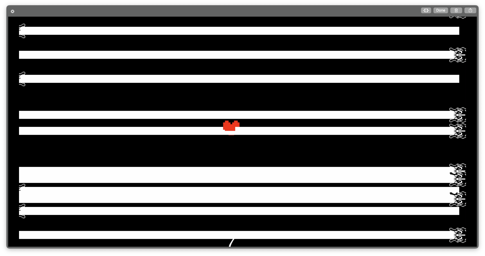

# undertale (tiny tiny tiny piece)

Run it the way you run Tetris

Move with WASD

Don't get hit by bones or laser (Hit box is smaller than image)

10HP, press C for cheating, 1MB of judgement will be added to your memory

The game only ends until you die. unfair right? 

Original idea was from here [Undertale San Fight]("https://www.youtube.com/watch?v=Vr4IYjeplJA")

But who am I trying to reproduce that

# How to run

uhh, go to UndertaleGame file, click on the run button next to class UndertaleGame

gradlew run doesn't work because I teared the tetris's soul for this 

cross the previous line, it works now, changed build.gradle file

